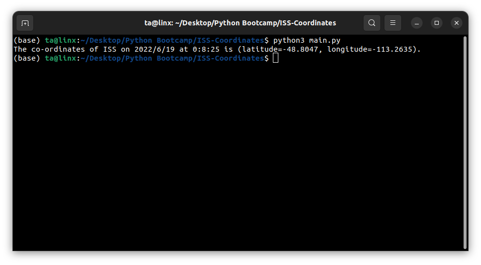

# ISS-Coordinates

### [twitter](https://twitter.com/achte_te)

## Description
An application that prints the realtime coordinates of International Space Station, everytime the application is run.  The coordinates can be checked at [coordinate_checker](https://www.latlong.net/Show-Latitude-Longitude.html).  
## Requirements

[Python](https://www.python.org/)

```sh
$ python3 --version
Python 3.9.12
```

[requests](https://pypi.org/project/requests/)

[datetime](https://docs.python.org/3/library/datetime.html)

[ISS API](http://open-notify.org/Open-Notify-API/ISS-Location-Now/)

## Install

```sh
$ git clone git@github.com:achte-2022/ISS-Coordinates.git
```

## Run

```sh
$ cd ISS-Coordinates
$ python3 main.py
```

## Application Screen

### Starting Screen
